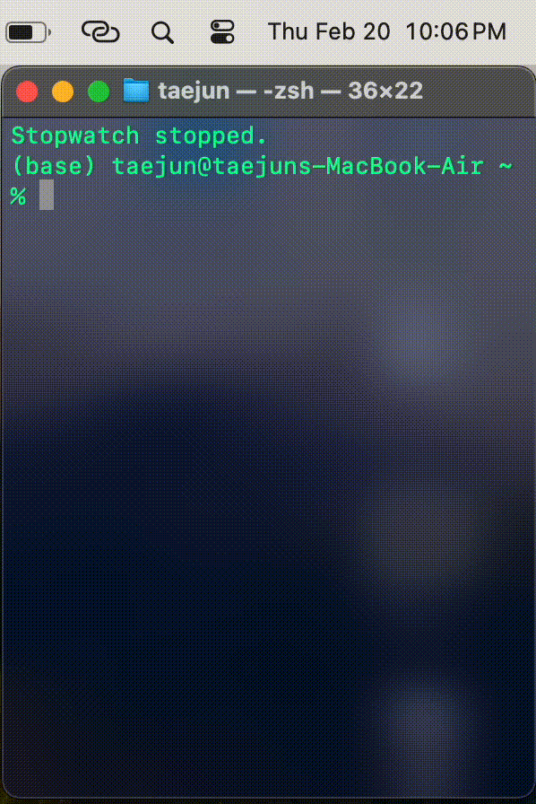

# Terminal Stopwatch

A terminal-based stopwatch application featuring ASCII art time display.



[](https://badge.fury.io/py/terminal-stopwatch)
[](https://opensource.org/licenses/MIT)

## Features

- ⏱️ Precise Time Measurement
  - Accurate timing down to milliseconds
  - Start, pause, and resume functionality
- 🎯 Lap Time Recording
  - Unlimited lap time recording
  - Display of individual and cumulative lap times
- 🎨 ASCII Art Time Display
  - Large font ASCII art time display
  - Highly visible and intuitive display
- 🌈 Colorful Terminal Interface
  - Color-coded function indicators
  - User-friendly interface

## Installation

### Using pip (Recommended)

```bash
pip install terminal-stopwatch
```

After installation, run:
```bash
stopwatch
```

### Using Executable

1. Download the `stopwatch` executable for your OS from the [latest release](https://github.com/taejun/stopwatch/releases/latest)
2. Grant execution permission in terminal:
   ```bash
   chmod +x ./stopwatch
   ```
3. Run:
   ```bash
   ./stopwatch
   ```

### From Source Code

1. Clone the repository:
   ```bash
   git clone https://github.com/taejun/stopwatch.git
   cd stopwatch
   ```

2. Install Poetry (Package Manager):
   ```bash
   curl -sSL https://install.python-poetry.org | python3 -
   ```

3. Install dependencies:
   ```bash
   poetry install
   ```

4. Run:
   ```bash
   poetry run python -m terminal_stopwatch
   ```

## Usage

### Basic Controls

- `s`: 🚀 Start/Pause
  - First press starts the stopwatch
  - Second press pauses
  - Press while paused resumes
- `l`: 📝 Record Lap Time
  - Records current time as a lap
  - Unlimited number of laps
- `r`: 🔄 Reset
  - Clears all times and laps
  - Only works when paused
- `q`: 🚫 Quit
  - Exits the program

### Interface Layout

```+-------------------------+
|     ASCII Art Time      |
|      00:00:00.000      |
+-------------------------+
| Last Lap: 00:00:00.000 |
| Total Laps: 0          |
+-------------------------+
| Controls:              |
| s: Start/Pause         |
| l: Lap                 |
| r: Reset               |
| q: Quit                |
+-------------------------+
```

## Project Structure

```
terminal_stopwatch/
├── __init__.py          # Package initialization and version info
└── main.py              # Main application logic

```

## Development Environment

- Python 3.11+
- Poetry (Dependency Management)
- PyInstaller (Executable Creation)

## Dependencies

- pyfiglet (^1.0.2): ASCII Art Generation
- colorama (^0.4.6): Terminal Color Support
- readchar (^4.0.5): Keyboard Input Handling

## License

This project is licensed under the MIT License. See the [LICENSE](LICENSE) file for details.

## Contributing

1. Fork the Project
2. Create your Feature Branch (`git checkout -b feature/AmazingFeature`)
3. Commit your Changes (`git commit -m 'Add some AmazingFeature'`)
4. Push to the Branch (`git push origin feature/AmazingFeature`)
5. Open a Pull Request

## Author

- taejun (dugudugu0622@gmail.com)
- GitHub: [@taejun](https://github.com/taejun)

## Changelog

### [1.0.0] - 2024-02-20
- Initial Release
- Basic stopwatch functionality
- Published to PyPI 
